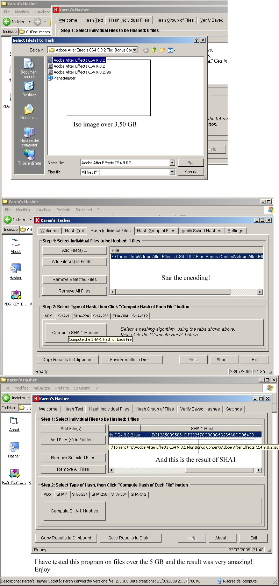



## Compute MD5\-SHA\-224\-256\-384\-512 Algorithm of VERY BIG Files

### Description

Compute MD5-SHA-224-256-384-512 Algorithm of VERY BIG Files! I found in the network this very interesting project. I hope that might be useful!

Enjoy!
 
### More Info
 

             |
---                |---
**Submitted On**   |2007-06-08 13:42:30
**By**             |[Salvo Cortesiano \(Italy\)](https://github.com/Planet-Source-Code/PSCIndex/blob/master/ByAuthor/salvo-cortesiano-italy.md)
**Level**          |Advanced
**User Rating**    |5.0 (15 globes from 3 users)
**Compatibility**  |VB 6\.0
**Category**       |[Complete Applications](https://github.com/Planet-Source-Code/PSCIndex/blob/master/ByCategory/complete-applications__1-27.md)
**World**          |[Visual Basic](https://github.com/Planet-Source-Code/PSCIndex/blob/master/ByWorld/visual-basic.md)
**Archive File**   |[Compute\_MD2158307232009\.zip](https://github.com/Planet-Source-Code/salvo-cortesiano-italy-compute-md5-sha-224-256-384-512-algorithm-of-very-big-files__1-72300/archive/master.zip)

